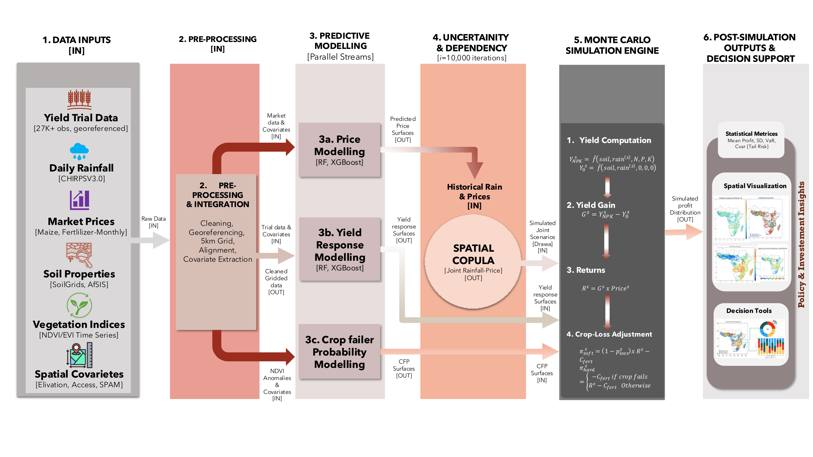
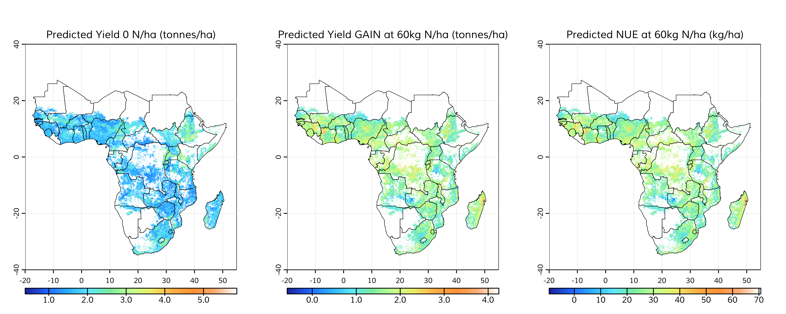
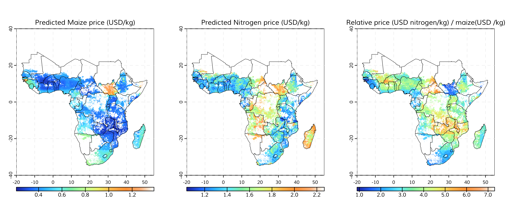
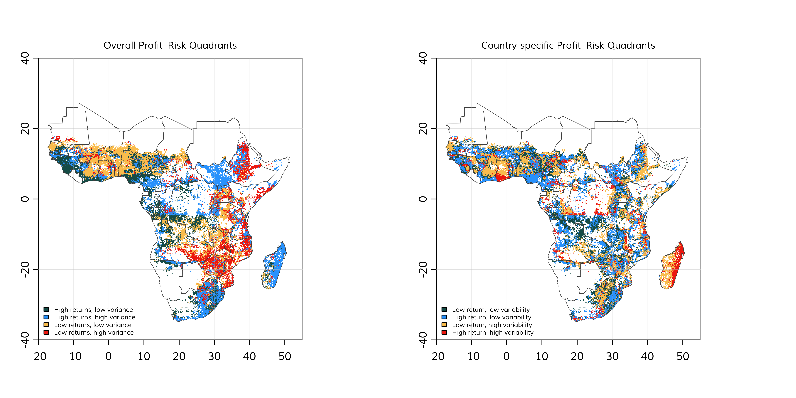
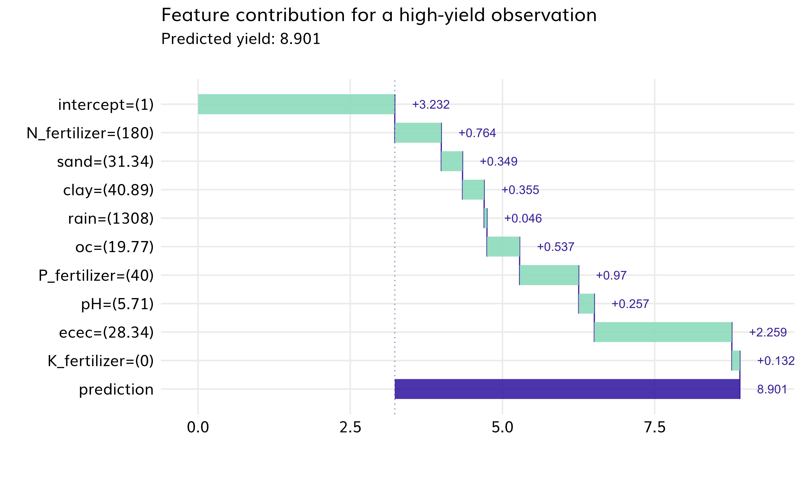

# SSA Yield Uncertainty — Risk-Adjusted Returns to Fertilizer Across Sub-Saharan Africa

**A spatially explicit modeling framework that estimates site-specific maize yield response to fertilizer and the risk-adjusted profitability of fertilizer investment across Sub-Saharan Africa, under joint climate and price uncertainty.**

> **🚧 Code release pending.** The analysis behind this repository is still being finalised. This repository currently documents *what* we model and *how* the pipeline is structured. The full R/Python pipeline, configuration, and final result maps will be published here once the working paper is complete. Watch/star the repo to be notified.

---

## 1. What is this project, in one paragraph?

Fertilizer recommendations in Sub-Saharan Africa are usually built on *expected* yield response at *average* prices. But smallholders farm rainfed land with erratic rainfall and sell into volatile markets — what matters to them is not the average return but the **distribution** of returns, including the chance of losing money. This project builds, for every maize-growing pixel in Sub-Saharan Africa, that full distribution: it combines agronomic trial data, soil and climate layers, and predicted local input and output prices, then jointly simulates rainfall and maize-price realisations with a spatial copula Monte Carlo engine to map **where, and at what application rate, fertilizer is a good bet — not just a good average**. By separating climate risk from price risk and mapping high- and low-response zones, the framework supports precision targeting of subsidies, extension, insurance, and complementary interventions.

## 2. Why this matters

- **Fertilizer use in SSA is strikingly low** — around **17 kg of nutrients per hectare** against a global average of ~135 kg/ha, and well short of the 2006 Abuja Declaration target of 50 kg/ha.
- **Profitability, not awareness, is the binding constraint in much of the region.** Fertilizer is expensive at the farm gate while crop prices are low; in Ghana the value–cost ratio for maize fertilizer fell from ~6.8 in the 1980s to ~2.2 in the early 2000s, and recent farm surveys found fertilizer fully profitable (VCR ≥ 2) for only ~28 % of farmers, with nearly half not breaking even.
- **Risk changes the calculus drastically.** Farmers buy fertilizer months before harvest in rainfed systems — essentially betting on the season. A recent continental analysis (McCullough et al. 2022, *Nature Food*) estimated that in about a quarter of rainfed maize areas in SSA, farmers cannot expect even a 30 % return on fertilizer in at least 70 % of seasons.
- **Blanket recommendations make this worse.** One-size-fits-all rates ignore the enormous spatial heterogeneity in soils, rainfall, and prices — oversupplying nutrients where response is weak and undersupplying where it is strong.

The right question for a farmer, an extension service, or a subsidy designer is therefore site-specific and probabilistic: **on this field, at this fertilizer price and this likely maize price, what application rate maximises risk-adjusted profit — and what is the chance of a loss?** That is the question this framework answers, pixel by pixel.

## 3. What we model

The framework couples three estimated surfaces — yield response, input/output prices, and production risk — inside a stochastic profit simulation:

```
profit(pixel, N rate)  =  price_maize(pixel, draw) × yield(pixel, N, rainfall draw)
                        −  price_N(pixel) × N rate
                        −  application & financing costs
```

evaluated over many joint draws of seasonal rainfall and maize price, preserving their spatial structure and their dependence.

<p align="center">
  
</p>

*The approach in one picture: six data streams are cleaned and integrated on a common 5 km grid; three predictive models (prices, yield response, crop-failure probability) are fit in parallel; a spatial copula generates 10,000 joint rainfall–price scenarios; and the Monte Carlo engine converts each scenario into per-pixel profit, producing full profit distributions and tail-risk metrics. (Vector version: [`docs/figures/flow-chart-3.pdf`](docs/figures/flow-chart-3.pdf).)*

### Pipeline stages

| Stage | What it does |
|---|---|
| **0 — Climate data** | Google Earth Engine export of CHIRPS v3.0 daily rainfall (1981–2024), aggregated to maize growing-season indicators per pixel. |
| **1 — Base layers & rainfall indicators** | SSA country mask (GADM), soil property rasters (SoilGrids / AfSIS / iSDA), and derived season-rainfall indicators including drought (< 50 % of normal) and excess-rain (> 150 % of normal) flags — all integrated on a common ~5 km grid. |
| **2 — Price models** | Cleaning and spatial prediction (random forest / XGBoost) of fertilizer (nitrogen) prices from the AfricaFertilizer 2010–2024 price database, and of maize producer prices from World Bank RTFP / WFP monthly market data (2007–2024) — including a maize price-volatility surface. Farmgate prices decay with travel time to the nearest market. |
| **3 — Yield response** | Machine-learning yield-response models (random forest / XGBoost) for nitrogen and phosphorus, trained on a georeferenced compilation of **27,000+ agronomic-trial observations** (CAROB) enriched with soil and seasonal-rainfall covariates, with genetic-algorithm rate optimisation and model-explainability diagnostics (DALEX/iml). Trial-station yields are calibrated downward (~0.65×) to reflect the documented 30–50 % trial-versus-smallholder yield gap. |
| **4 — Crop-failure probability** | Per-pixel probability of severe crop loss estimated from two independent sources: household-survey reports and an NDVI-anomaly-based classifier. Enters the profit simulation both as a *soft* expected-value adjustment and as a *hard* failure draw (fertilizer cost lost, no revenue). |
| **5 — Monte Carlo risk engine** | The core contribution: a **spatial copula simulation** (latent Gaussian random fields with empirical-CDF margins; Kendall τ mapped to Gaussian correlation) jointly simulating seasonal rainfall and maize price over the whole SSA domain — **10,000 iterations** — fed through the yield-response and crop-failure models to produce per-pixel **profit distributions** under three scenarios: (i) joint climate–price risk, (ii) climate-only risk, and (iii) price-only risk. |
| **6 — Decision-support outputs** | Per-pixel statistical metrics from the simulated profit distributions — mean profit, standard deviation, Value-at-Risk and Conditional Value-at-Risk (tail risk) — plus maps, summary tables, and decision tools. |

### Key modelling choices

| Choice | Setting |
|---|---|
| Crop | Maize (the dominant SSA staple) |
| Working grid | ~5 km, full Sub-Saharan Africa |
| Nitrogen rates evaluated | 0–200 kg N/ha in 10 kg steps |
| Rainfall record | CHIRPS v3.0, 1981–2024 |
| Price record | 2007–2024, fertilizer and maize |
| Monte Carlo iterations | 10,000 joint rainfall–price scenarios |
| Copula spatial ranges | ~200 km (rainfall), ~250 km (price) |
| Smallholder yield calibration | 0.65 × trial-fitted yields |
| Farmgate price factor | 0.55 near markets → 0.15 beyond 6 h travel time |
| Risk metrics | mean profit, SD, probability of loss, VaR, CVaR |

## 4. Data sources

All inputs are public or published datasets:

| Dataset | Role |
|---|---|
| CHIRPS v3.0 daily rainfall (via Google Earth Engine) | growing-season rainfall indicators, 1981–2024 |
| GADM boundaries | SSA country mask |
| SoilGrids / AfSIS / iSDA soil properties | soil covariates for the yield-response model |
| CAROB agronomic-trial compilation (27,000+ georeferenced observations) | multi-location fertilizer-response trials for model training |
| AfricaFertilizer price database (2010–2024) | nitrogen price surfaces |
| World Bank RTFP / WFP monthly market prices (2007–2024) | maize price prediction and volatility |
| NDVI time series | remote-sensing crop-loss probability |
| Household survey data | survey-based crop-loss probability |
| Travel-time-to-cities surface | farmgate price adjustment |
| Elevation, market access, SPAM crop layers | spatial covariates |

## 5. Preliminary results

> Preliminary figures from the current model run. Numbers and maps may change before the final release.

**Highlights so far:**

- **The response is real but spatially very uneven.** Predicted maize yields without nitrogen sit mostly at 1–2 t/ha across the region; at a moderate 60 kg N/ha the predicted yield *gain* and nitrogen-use efficiency vary several-fold across pixels, with strong response zones concentrated in the West African savanna and parts of Eastern and Southern Africa.

<p align="center">
  
</p>

- **Price geography compounds agronomic geography.** Predicted farmgate maize and nitrogen prices each vary widely across the continent, and their ratio — how many kilograms of maize one kilogram of nitrogen costs — ranges from roughly 1–2 in well-connected surplus zones to 6–7 in remote, high-input-cost areas. The same yield response can be comfortably profitable in one district and a losing bet two districts away.

<p align="center">
  
</p>

- **Return and risk do not map onto each other.** Classifying every pixel by expected profit × profit variability yields four quadrants. High-return/low-risk zones (the natural first targets for fertilizer promotion) coexist with high-return/high-risk zones (where insurance or stress-tolerant varieties are the right complement) and low-return zones where fertilizer promotion alone is hard to justify. The classification shifts meaningfully when thresholds are set country-by-country rather than continent-wide — a caution against one-size-fits-all targeting.

<p align="center">
  
</p>

- **The yield model is interpretable, and soil fertility does much of the work.** Per-observation explainability breakdowns show that in high-yield cases, soil properties (notably effective cation-exchange capacity and organic carbon) contribute as much as or more than the fertilizer terms themselves — quantitative support for the long-standing finding that fertilizer pays best on soils in good condition.

<p align="center">
  
</p>

## 6. Outputs the final release will include

| Output | Description |
|---|---|
| **Risk-adjusted profitability maps** | Per-pixel expected profit, probability of loss, and downside-risk metrics for fertilizer use, under joint climate–price, climate-only, and price-only uncertainty. |
| **Optimal-rate maps** | Economically optimal (risk-adjusted) nitrogen application rates, contrasted with blanket recommendations. |
| **Yield-response surfaces** | Site-specific predicted maize response to N and P. |
| **Price surfaces** | Predicted local nitrogen prices, maize prices, and maize price volatility. |
| **Crop-loss probability maps** | Survey-based and NDVI-based severe-loss probabilities. |
| **Full pipeline** | The reproducible R/Python code, configuration, and documentation. |

Final headline numbers will be added to this README with the working-paper release. The model outputs also power a farmer-facing digital advisory service that translates the per-pixel distributions into plain-language recommendations.

## 7. Repository structure

```
ssa-yield-uncertainty/
├── README.md          ← you are here
├── LICENSE            ← MIT
├── CITATION.cff
├── R/                 ← shared helpers (placeholder — released with the working paper)
├── config/            ← centralized pipeline configuration (placeholder)
├── data/              ← input & intermediate data (placeholder — fetch instructions to follow)
└── docs/
    └── figures/       ← approach flowchart + preliminary result figures
```

The numbered pipeline scripts (stages 0–6 above) will live at the repository root and run in numeric order.

## 8. Citation

If you reference this work before the working paper is out, please cite the repository (see [`CITATION.cff`](CITATION.cff)).

## 9. Contact

Bisrat Haile — bismignot@gmail.com

---

*This repository is a public placeholder for an analysis in progress. Figures and numbers shown here are preliminary and may change before the final release.*
